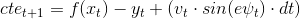

# Model Predictive Control

Self-Driving Car Engineer Nanodegree Program

## Requirements

* cmake >= 3.5
  * All OSes: [click here for installation instructions](https://cmake.org/install/)
* make >= 4.1 (Linux, Mac), 3.81 (Windows)
  * Linux: make is installed by default on most Linux distros
  * Mac: [install Xcode command line tools to get make](https://developer.apple.com/xcode/features/)
  * Windows: [Click here for installation instructions](http://gnuwin32.sourceforge.net/packages/make.htm)
* gcc/g++ >= 5.4
  * Linux: gcc / g++ is installed by default on most Linux distros
  * Mac: same deal as make - [install Xcode command line tools](https://developer.apple.com/xcode/features/)
  * Windows: recommend using [MinGW](http://www.mingw.org/)
* Udacity Simulator [Download link](https://github.com/udacity/self-driving-car-sim/releases)

Tips for setting up the environment can be found [here](https://classroom.udacity.com/nanodegrees/nd013/parts/40f38239-66b6-46ec-ae68-03afd8a601c8/modules/0949fca6-b379-42af-a919-ee50aa304e6a/lessons/f758c44c-5e40-4e01-93b5-1a82aa4e044f/concepts/23d376c7-0195-4276-bdf0-e02f1f3c665d).

## Compilation and Execution

1. Clone this repo
2. cd to repo root dir.
3. `mkdir build`
4. `cd build`
5. `cmake ..`
6. `make`
7. `./mpc`
8. Run simulator

---

## Rubric

### Compilation

#### Your code should compile

The code compiles without errors with `cmake` and `make`. The `CMakeLists.txt` file was not changed from the original version.

### Implementation

#### The model

The kinemactic model that we have used in this project corresponds to the one explained in the lessons. This model is able to predict the state of the next time step by taking into account the current state and the actuators according to the following equations (where `x_t` and `y_t` are the current vehicle coordinates, `v_t` is the current velocity, and `psi_t` is the current orientation angle):

The Cross Track Error (CTE) and Psi error (Epsi) are computed as follows:

This model was implemented in lines 83-88 of `src/MPC.cpp` by filling the corresponding positions of the `fg` array.

#### Timestep length and elapsed duration (N & dt)

The timestep length and duration combination that provided the best results was `N=10` and `dt=0.1`. Those values were empirically chosen after trying various combinations.

#### Polynomial fitting and MPC processing

A third order polynomial is fitted to the waypoints in line 115 of `src/main.cpp` to later feed the MPC solver. Before that fitting, the waypoints are preprocessed (lines 108-113 of `src/main.cpp`) to transform them into the vehicle's space.

#### Model predictive control with latency

Our MPC implementation is able to handle a 100 millisecond latency. In order to achieve this robustness we were inspired by other approaches taken by Jeremy Shannon and NikolasEnt. On the one hand, the original equations for the kinematics depend on the actuations from the previous timestep. However, with 100ms delay they are applied one timestep later (which is 100ms or 0.1s, our specified `dt`). To take that into account, we introduced code in `src/MPC.cpp` (lines 66-69) to make the model use the previous timestep actuations to account for latency. On the other hand, we also penalized the combination of velocity and delta (line 29 on `src/MPC.cpp`) with a weight `w_dv`.

### Simulation

#### The vehicle must successfully drive a lap around the track

Using our MPC implementation, the car is able to successfully drive a lap around the track without popping up onto ledges or rolling over any surfaces that would be considered unsafe. A video is included to demo that successful lap.

